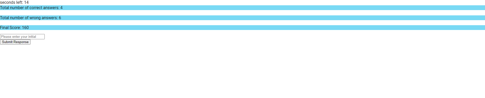

# Coding-Quiz
Coding Quiz that has no scaffolding code.

* First screenshot

* Second screenshot

* Third screenshot

### description
This challenge used my newly learned DOM manipulation to communicate user's interaction with the application, and create HTML objects. 